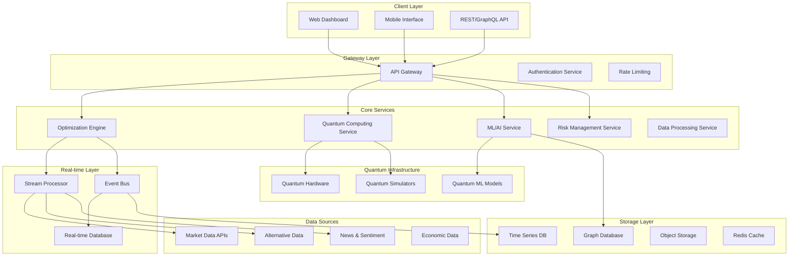

# Design Document

## Overview

The Advanced Quantum Features enhancement transforms QuantumFinanceOpt into a next-generation portfolio optimization platform that leverages true quantum computing, real-time market integration, advanced AI, and institutional-grade features. The design follows a microservices architecture with quantum-classical hybrid computing, real-time data streaming, and high-performance computing capabilities.

## Architecture

The enhanced system adopts a distributed, event-driven microservices architecture designed for scalability, real-time processing, and quantum-classical hybrid computing:



### Design Principles

1. **Quantum-First Architecture**: Native quantum computing integration with classical fallbacks
2. **Real-time Processing**: Sub-second latency for critical operations
3. **Microservices**: Loosely coupled, independently scalable services
4. **Event-Driven**: Asynchronous processing with event sourcing
5. **High Availability**: Fault-tolerant design with automatic failover
6. **Regulatory Compliance**: Built-in audit trails and compliance features

## Components and Interfaces

### 1. Quantum Computing Service

**Primary Interface:**
```python
class QuantumComputingService:
    def __init__(self, quantum_backend: str, classical_fallback: bool = True)
    
    # Quantum Optimization Algorithms
    def qaoa_portfolio_optimization(self, returns: np.ndarray, constraints: Dict) -> QuantumResult
    def vqe_risk_modeling(self, covariance: np.ndarray) -> QuantumRiskModel
    def quantum_annealing_optimization(self, problem: QuadraticModel) -> AnnealingResult
    
    # Quantum Machine Learning
    def quantum_neural_network(self, features: np.ndarray, targets: np.ndarray) -> QNNModel
    def variational_classifier(self, data: np.ndarray, labels: np.ndarray) -> VQCModel
    def quantum_kernel_methods(self, X_train: np.ndarray, X_test: np.ndarray) -> np.ndarray
    
    # Quantum Advantage Assessment
    def estimate_quantum_advantage(self, problem_size: int, complexity: str) -> AdvantageMetrics
    def benchmark_quantum_classical(self, problem: OptimizationProblem) -> BenchmarkResult
```

**Quantum Algorithm Implementations:**
```python
# QAOA for Portfolio Optimization
class QAOAPortfolioOptimizer:
    def __init__(self, num_qubits: int, num_layers: int)
    def create_cost_hamiltonian(self, returns: np.ndarray, risk_matrix: np.ndarray) -> Hamiltonian
    def create_mixer_hamiltonian(self, constraints: Dict) -> Hamiltonian
    def optimize_parameters(self, initial_params: np.ndarray) -> OptimizationResult
    def execute_circuit(self, params: np.ndarray) -> QuantumState

# VQE for Risk Modeling
class VQERiskModel:
    def __init__(self, ansatz: QuantumCircuit, optimizer: ClassicalOptimizer)
    def construct_risk_hamiltonian(self, correlation_matrix: np.ndarray) -> Hamiltonian
    def find_ground_state(self) -> GroundStateResult
    def compute_risk_metrics(self, ground_state: QuantumState) -> RiskMetrics
```

### 2. Real-time Data Integration Service

**Streaming Data Interface:**
```python
class RealTimeDataService:
    def __init__(self, data_providers: List[str], update_frequency: str)
    
    # Data Stream Management
    def subscribe_to_streams(self, symbols: List[str], data_types: List[str]) -> StreamSubscription
    def process_market_data(self, data_stream: DataStream) -> ProcessedData
    def handle_data_quality_issues(self, data: RawData) -> CleanedData
    
    # Real-time Processing
    def trigger_rebalancing(self, market_event: MarketEvent) -> RebalanceSignal
    def update_risk_metrics(self, new_data: MarketData) -> RiskUpdate
    def detect_regime_changes(self, market_data: TimeSeriesData) -> RegimeSignal
    
    # Alternative Data Integration
    def process_satellite_data(self, satellite_feed: SatelliteData) -> EconomicIndicators
    def analyze_social_sentiment(self, social_data: SocialMediaData) -> SentimentScores
    def integrate_economic_data(self, econ_data: EconomicData) -> MacroSignals
```

**Event Processing Pipeline:**
```python
class EventProcessor:
    def __init__(self, event_bus: EventBus, processors: List[Processor])
    
    def process_price_update(self, price_event: PriceEvent) -> List[PortfolioUpdate]
    def process_news_event(self, news_event: NewsEvent) -> List[SentimentUpdate]
    def process_risk_breach(self, risk_event: RiskEvent) -> List[RiskAction]
    def process_execution_signal(self, signal: ExecutionSignal) -> List[TradeOrder]
```

### 3. Advanced AI/ML Service

**Transformer-based Forecasting:**
```python
class TransformerForecastingService:
    def __init__(self, model_config: TransformerConfig)
    
    # Multi-horizon Forecasting
    def train_attention_model(self, time_series: pd.DataFrame, horizons: List[int]) -> AttentionModel
    def forecast_returns(self, historical_data: pd.DataFrame, horizon: int) -> ForecastResult
    def update_model_online(self, new_data: pd.DataFrame) -> ModelUpdate
    
    # Cross-asset Attention
    def build_cross_asset_attention(self, asset_data: Dict[str, pd.DataFrame]) -> CrossAssetModel
    def analyze_attention_weights(self, model: AttentionModel) -> AttentionAnalysis
```

**Reinforcement Learning Service:**
```python
class RLTradingService:
    def __init__(self, env_config: TradingEnvConfig, agent_config: AgentConfig)
    
    # Deep RL Agents
    def train_dqn_agent(self, env: TradingEnvironment, episodes: int) -> DQNAgent
    def train_actor_critic(self, env: TradingEnvironment, episodes: int) -> A3CAgent
    def train_ppo_agent(self, env: TradingEnvironment, episodes: int) -> PPOAgent
    
    # Multi-agent Systems
    def create_multi_agent_env(self, agents: List[Agent]) -> MultiAgentEnv
    def coordinate_agents(self, agents: List[Agent], market_state: MarketState) -> CoordinatedActions
```

**Graph Neural Networks:**
```python
class GraphNeuralNetworkService:
    def __init__(self, graph_config: GraphConfig)
    
    # Asset Relationship Modeling
    def build_asset_graph(self, correlation_data: pd.DataFrame, threshold: float) -> AssetGraph
    def train_gnn_model(self, graph: AssetGraph, features: np.ndarray) -> GNNModel
    def predict_with_gnn(self, model: GNNModel, graph: AssetGraph) -> GraphPredictions
    
    # Dynamic Graph Updates
    def update_graph_structure(self, new_correlations: pd.DataFrame) -> GraphUpdate
    def detect_graph_anomalies(self, graph: AssetGraph) -> List[GraphAnomaly]
```

### 4. Advanced Risk Management Service

**Comprehensive Risk Interface:**
```python
class AdvancedRiskService:
    def __init__(self, risk_config: RiskConfig)
    
    # Value at Risk Calculations
    def calculate_parametric_var(self, portfolio: Portfolio, confidence: float) -> VaRResult
    def calculate_historical_var(self, returns: pd.Series, confidence: float) -> VaRResult
    def calculate_monte_carlo_var(self, portfolio: Portfolio, simulations: int) -> VaRResult
    
    # Stress Testing
    def run_historical_stress_tests(self, portfolio: Portfolio, scenarios: List[str]) -> StressResults
    def run_custom_stress_test(self, portfolio: Portfolio, scenario: CustomScenario) -> StressResult
    def analyze_tail_risk(self, returns: pd.Series) -> TailRiskMetrics
    
    # Regime Detection
    def detect_market_regimes(self, market_data: pd.DataFrame) -> RegimeAnalysis
    def adjust_risk_models(self, current_regime: MarketRegime) -> RiskModelUpdate
    
    # Regulatory Compliance
    def check_position_limits(self, portfolio: Portfolio, limits: PositionLimits) -> ComplianceResult
    def generate_regulatory_report(self, portfolio: Portfolio, jurisdiction: str) -> RegulatoryReport
```

### 5. Algorithmic Trading Service

**Execution Algorithms:**
```python
class AlgorithmicTradingService:
    def __init__(self, execution_config: ExecutionConfig)
    
    # Execution Algorithms
    def execute_twap(self, order: Order, time_window: int) -> ExecutionResult
    def execute_vwap(self, order: Order, volume_profile: VolumeProfile) -> ExecutionResult
    def execute_implementation_shortfall(self, order: Order, risk_aversion: float) -> ExecutionResult
    
    # Transaction Cost Analysis
    def estimate_transaction_costs(self, orders: List[Order]) -> TransactionCostEstimate
    def analyze_execution_quality(self, executed_orders: List[ExecutedOrder]) -> ExecutionAnalysis
    def optimize_order_routing(self, order: Order, venues: List[Venue]) -> RoutingDecision
    
    # Market Microstructure
    def analyze_liquidity(self, symbol: str, time_window: int) -> LiquidityAnalysis
    def detect_market_impact(self, order: Order, market_data: MarketData) -> ImpactEstimate
```

### 6. High-Performance Computing Service

**GPU Acceleration Interface:**
```python
class HPCService:
    def __init__(self, compute_config: ComputeConfig)
    
    # GPU-Accelerated Operations
    def gpu_matrix_operations(self, matrices: List[np.ndarray], operation: str) -> np.ndarray
    def gpu_monte_carlo_simulation(self, parameters: SimulationParams, runs: int) -> SimulationResult
    def gpu_ml_training(self, model: MLModel, data: TrainingData) -> TrainedModel
    
    # Distributed Computing
    def distribute_optimization(self, problem: OptimizationProblem, nodes: int) -> DistributedResult
    def parallel_backtesting(self, strategies: List[Strategy], data: HistoricalData) -> BacktestResults
    def cluster_portfolio_analysis(self, portfolios: List[Portfolio]) -> ClusterAnalysis
    
    # Memory Optimization
    def stream_large_datasets(self, data_source: DataSource, chunk_size: int) -> DataStream
    def optimize_memory_usage(self, computation: Computation) -> OptimizedComputation
```

## Data Models

### Enhanced Data Structures

```python
@dataclass
class QuantumOptimizationResult:
    quantum_weights: np.ndarray
    classical_weights: np.ndarray
    quantum_advantage: float
    fidelity: float
    execution_time: float
    quantum_backend: str
    error_mitigation: Dict[str, Any]
    
@dataclass
class RealTimeMarketData:
    timestamp: datetime
    symbol: str
    price: float
    volume: int
    bid: float
    ask: float
    sentiment_score: float
    volatility: float
    liquidity_score: float
    
@dataclass
class AdvancedRiskMetrics:
    var_95: float
    var_99: float
    cvar_95: float
    cvar_99: float
    expected_shortfall: float
    maximum_drawdown: float
    tail_expectation: float
    regime_probability: Dict[str, float]
    stress_test_results: Dict[str, float]
    
@dataclass
class ExecutionResult:
    order_id: str
    symbol: str
    quantity: int
    average_price: float
    total_cost: float
    market_impact: float
    timing_cost: float
    execution_algorithm: str
    venue_breakdown: Dict[str, float]
    slippage: float
    
@dataclass
class AlternativeDataSignal:
    signal_type: str
    timestamp: datetime
    value: float
    confidence: float
    source: str
    processing_latency: float
    quality_score: float
```

## Error Handling

### Quantum-Specific Error Handling

```python
class QuantumComputingError(Exception):
    """Base exception for quantum computing errors"""
    pass

class QuantumHardwareError(QuantumComputingError):
    """Raised when quantum hardware is unavailable or fails"""
    pass

class QuantumCircuitError(QuantumComputingError):
    """Raised when quantum circuit compilation fails"""
    pass

class QuantumNoiseError(QuantumComputingError):
    """Raised when quantum noise exceeds acceptable thresholds"""
    pass
```

### Real-time Processing Error Handling

```python
class RealTimeProcessingError(Exception):
    """Base exception for real-time processing errors"""
    pass

class DataStreamError(RealTimeProcessingError):
    """Raised when data stream is interrupted or corrupted"""
    pass

class LatencyError(RealTimeProcessingError):
    """Raised when processing latency exceeds thresholds"""
    pass
```

### Fallback Mechanisms

1. **Quantum Fallbacks**: Automatic fallback to quantum-inspired classical algorithms
2. **Data Source Failover**: Automatic switching between data providers
3. **Model Degradation**: Graceful degradation to simpler models when complex ones fail
4. **Execution Fallbacks**: Alternative execution venues and algorithms

## Testing Strategy

### Quantum Computing Testing

1. **Quantum Circuit Validation**: Test quantum circuits on simulators before hardware execution
2. **Noise Characterization**: Test quantum algorithms under various noise conditions
3. **Classical Benchmarking**: Compare quantum results with classical baselines
4. **Hardware Integration**: Test integration with different quantum backends

### Real-time System Testing

1. **Latency Testing**: Measure and optimize system latency under various loads
2. **Throughput Testing**: Test system capacity with high-frequency data streams
3. **Failover Testing**: Test automatic failover mechanisms
4. **Data Quality Testing**: Test handling of corrupted or delayed data

### AI/ML Model Testing

1. **Model Performance**: Test prediction accuracy across different market conditions
2. **Model Drift Detection**: Test automatic detection and handling of model drift
3. **Ensemble Testing**: Test combination of multiple models
4. **Adversarial Testing**: Test model robustness against adversarial inputs

## Implementation Considerations

### Quantum Computing Integration

1. **Hardware Abstraction**: Support multiple quantum backends (IBM, Google, Rigetti, D-Wave)
2. **Error Mitigation**: Implement quantum error correction and mitigation techniques
3. **Circuit Optimization**: Optimize quantum circuits for specific hardware constraints
4. **Hybrid Algorithms**: Seamless integration of quantum and classical components

### Real-time Performance

1. **Low Latency**: Target sub-millisecond latency for critical operations
2. **High Throughput**: Handle thousands of updates per second
3. **Memory Efficiency**: Optimize memory usage for large-scale real-time processing
4. **Network Optimization**: Minimize network latency and maximize bandwidth utilization

### Scalability and Reliability

1. **Horizontal Scaling**: Auto-scaling based on load and demand
2. **Fault Tolerance**: Automatic recovery from component failures
3. **Data Consistency**: Ensure data consistency across distributed components
4. **Monitoring and Alerting**: Comprehensive monitoring with intelligent alerting

### Security and Compliance

1. **Data Encryption**: End-to-end encryption for sensitive financial data
2. **Access Control**: Role-based access control with multi-factor authentication
3. **Audit Trails**: Comprehensive logging for regulatory compliance
4. **Privacy Protection**: Data anonymization and privacy-preserving techniques

### Integration Architecture

1. **API Design**: RESTful and GraphQL APIs for external integration
2. **Event Streaming**: Apache Kafka for high-throughput event streaming
3. **Database Design**: Multi-model database architecture for different data types
4. **Caching Strategy**: Multi-level caching for optimal performance