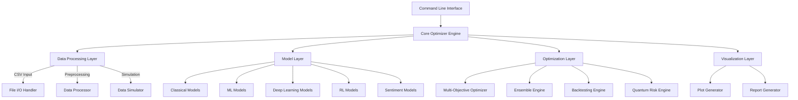

# Design Document

## Overview

QuantumFinanceOpt is designed as a modular, extensible portfolio optimization framework that integrates multiple optimization paradigms. The system follows a layered architecture with clear separation between data processing, model implementations, optimization engines, and visualization components. The design emphasizes offline operation, modularity, and extensibility while maintaining high performance for complex financial computations.

## Architecture

The system follows a modular architecture with the following key layers:



### Core Design Principles

1. **Modularity**: Each optimization method is implemented as a separate module with standardized interfaces
2. **Offline Operation**: All models and data processing work without external API dependencies
3. **Extensibility**: New optimization methods can be easily added through plugin architecture
4. **Performance**: Efficient computation using vectorized operations and GPU acceleration where available
5. **Robustness**: Comprehensive error handling and fallback mechanisms

## Components and Interfaces

### 1. Core Optimizer Engine (`QuantumFinanceOptimizer`)

**Primary Interface:**
```python
class QuantumFinanceOptimizer:
    def __init__(self, config: OptimizationConfig)
    def load_data(self, csv_path: str) -> pd.DataFrame
    def classical_optimization(self, method: str) -> OptimizationResult
    def ml_optimization(self, models: List[str]) -> OptimizationResult
    def dl_optimization(self, architecture: str) -> OptimizationResult
    def rl_optimization(self, agent_type: str) -> OptimizationResult
    def ensemble_optimization(self, methods: List[str]) -> OptimizationResult
    def multi_objective_optimization(self, objectives: List[str]) -> OptimizationResult
    def backtest(self, strategy: Strategy, start_date: str, end_date: str) -> BacktestResult
    def generate_reports(self, results: List[OptimizationResult]) -> None
```

### 2. Data Processing Layer

**Data Handler Interface:**
```python
class DataProcessor:
    def load_csv(self, path: str) -> pd.DataFrame
    def preprocess_data(self, data: pd.DataFrame) -> ProcessedData
    def compute_returns(self, prices: pd.DataFrame) -> pd.DataFrame
    def handle_missing_data(self, data: pd.DataFrame, method: str) -> pd.DataFrame
    def generate_sample_data(self, tickers: List[str], periods: int) -> pd.DataFrame
    def simulate_news_data(self, tickers: List[str], dates: List[str]) -> pd.DataFrame
    def simulate_esg_scores(self, tickers: List[str]) -> Dict[str, float]
```

### 3. Model Layer

**Classical Models Interface:**
```python
class ClassicalOptimizer:
    def efficient_frontier(self, returns: pd.DataFrame, method: str) -> EfficientFrontier
    def hierarchical_risk_parity(self, returns: pd.DataFrame) -> np.ndarray
    def black_litterman(self, returns: pd.DataFrame, views: Dict) -> np.ndarray
    def quantum_risk_model(self, covariance: np.ndarray) -> float
```

**ML Models Interface:**
```python
class MLPredictor:
    def train_ensemble(self, features: np.ndarray, targets: np.ndarray) -> List[Model]
    def predict_returns(self, features: np.ndarray) -> np.ndarray
    def create_features(self, data: pd.DataFrame) -> np.ndarray
    def sparse_optimization(self, returns: np.ndarray, lambda_reg: float) -> np.ndarray
```

**Deep Learning Interface:**
```python
class DLOptimizer:
    def build_lstm(self, input_shape: Tuple, units: int) -> tf.keras.Model
    def train_deepdow_network(self, data: np.ndarray) -> deepdow.Network
    def load_transformer_model(self, model_name: str) -> transformers.PreTrainedModel
    def forecast_returns(self, data: np.ndarray, horizon: int) -> np.ndarray
```

**RL Interface:**
```python
class RLAgent:
    def create_environment(self, data: pd.DataFrame) -> gym.Env
    def train_policy_gradient(self, env: gym.Env, episodes: int) -> Policy
    def dynamic_rebalancing(self, policy: Policy, data: pd.DataFrame) -> List[np.ndarray]
```

**Sentiment Analysis Interface:**
```python
class SentimentAnalyzer:
    def load_finbert_model(self) -> transformers.PreTrainedModel
    def analyze_sentiment(self, texts: List[str]) -> List[float]
    def adjust_returns_by_sentiment(self, returns: np.ndarray, sentiment: np.ndarray, alpha: float) -> np.ndarray
```

### 4. Optimization Layer

**Multi-Objective Optimizer:**
```python
class MultiObjectiveOptimizer:
    def setup_nsga2(self, objectives: List[Callable], constraints: List[Callable]) -> pymoo.Algorithm
    def optimize_portfolio(self, returns: pd.DataFrame, objectives: List[str]) -> List[np.ndarray]
    def apply_esg_constraints(self, weights: np.ndarray, esg_scores: Dict, threshold: float) -> np.ndarray
```

**Ensemble Engine:**
```python
class EnsembleEngine:
    def combine_predictions(self, predictions: List[np.ndarray], weights: np.ndarray) -> np.ndarray
    def adaptive_weighting(self, performance_history: List[float]) -> np.ndarray
    def robust_aggregation(self, predictions: List[np.ndarray], method: str) -> np.ndarray
```

### 5. Backtesting and Risk Assessment

**Backtesting Engine:**
```python
class BacktestEngine:
    def simulate_trading(self, strategy: Strategy, data: pd.DataFrame) -> BacktestResult
    def monte_carlo_simulation(self, strategy: Strategy, scenarios: int) -> List[BacktestResult]
    def calculate_performance_metrics(self, returns: pd.Series) -> Dict[str, float]
    def risk_assessment(self, returns: pd.Series) -> RiskMetrics
```

### 6. Visualization Layer

**Visualization Interface:**
```python
class VisualizationEngine:
    def plot_efficient_frontier(self, frontier_data: np.ndarray) -> plt.Figure
    def plot_allocation_pie(self, weights: np.ndarray, tickers: List[str]) -> plt.Figure
    def plot_performance_curves(self, returns: pd.Series) -> plt.Figure
    def plot_correlation_heatmap(self, correlation_matrix: np.ndarray) -> plt.Figure
    def generate_comprehensive_report(self, results: OptimizationResult) -> None
```

## Data Models

### Core Data Structures

```python
@dataclass
class ProcessedData:
    prices: pd.DataFrame
    returns: pd.DataFrame
    tickers: List[str]
    dates: pd.DatetimeIndex
    metadata: Dict[str, Any]

@dataclass
class OptimizationResult:
    weights: np.ndarray
    expected_return: float
    volatility: float
    sharpe_ratio: float
    sortino_ratio: float
    max_drawdown: float
    method: str
    timestamp: datetime
    metadata: Dict[str, Any]

@dataclass
class BacktestResult:
    cumulative_returns: pd.Series
    portfolio_values: pd.Series
    drawdowns: pd.Series
    performance_metrics: Dict[str, float]
    trade_history: List[Trade]
    risk_metrics: RiskMetrics

@dataclass
class RiskMetrics:
    var_95: float
    cvar_95: float
    maximum_drawdown: float
    calmar_ratio: float
    quantum_entropy: float
    volatility: float

@dataclass
class OptimizationConfig:
    tickers: List[str]
    start_date: str
    end_date: str
    rebalance_frequency: str
    risk_free_rate: float
    esg_threshold: float
    budget: float
    transaction_costs: float
```

## Error Handling

### Error Handling Strategy

1. **Graceful Degradation**: If advanced methods fail, fallback to simpler alternatives
2. **Comprehensive Logging**: Detailed logging for debugging and monitoring
3. **Input Validation**: Strict validation of all inputs with clear error messages
4. **Resource Management**: Proper cleanup of GPU memory and file handles
5. **Exception Hierarchy**: Custom exception classes for different error types

```python
class QuantumFinanceOptError(Exception):
    """Base exception for QuantumFinanceOpt"""
    pass

class DataProcessingError(QuantumFinanceOptError):
    """Raised when data processing fails"""
    pass

class ModelTrainingError(QuantumFinanceOptError):
    """Raised when model training fails"""
    pass

class OptimizationError(QuantumFinanceOptError):
    """Raised when optimization fails to converge"""
    pass
```

### Fallback Mechanisms

1. **Model Failures**: If ML/DL models fail, use classical methods
2. **Data Issues**: If real data is unavailable, use simulated data
3. **Optimization Convergence**: If advanced optimizers fail, use simple mean-variance
4. **Memory Constraints**: Automatic batch processing for large datasets

## Testing Strategy

### Unit Testing
- **Data Processing**: Test data loading, preprocessing, and validation
- **Model Components**: Test each optimization method independently
- **Utility Functions**: Test mathematical computations and transformations
- **Error Handling**: Test exception handling and fallback mechanisms

### Integration Testing
- **End-to-End Workflows**: Test complete optimization pipelines
- **Model Interactions**: Test ensemble methods and model combinations
- **Data Flow**: Test data passing between components
- **Configuration Management**: Test different parameter combinations

### Performance Testing
- **Scalability**: Test with different dataset sizes
- **Memory Usage**: Monitor memory consumption during optimization
- **Computation Time**: Benchmark different optimization methods
- **GPU Utilization**: Test GPU acceleration where applicable

### Validation Testing
- **Financial Accuracy**: Validate against known financial benchmarks
- **Statistical Properties**: Test statistical properties of generated portfolios
- **Backtesting Accuracy**: Validate backtesting results against manual calculations
- **Model Performance**: Test prediction accuracy of ML/DL models

## Implementation Considerations

### Performance Optimizations
1. **Vectorized Operations**: Use NumPy and Pandas vectorized operations
2. **GPU Acceleration**: Leverage PyTorch GPU capabilities for deep learning
3. **Parallel Processing**: Use multiprocessing for Monte Carlo simulations
4. **Memory Management**: Efficient memory usage for large datasets
5. **Caching**: Cache expensive computations like covariance matrices

### Offline Model Management
1. **Model Storage**: Local storage of pre-trained Hugging Face models
2. **Version Control**: Track model versions and configurations
3. **Model Loading**: Efficient loading of large transformer models
4. **Fallback Models**: Simple models when complex ones are unavailable

### Configuration Management
1. **YAML Configuration**: External configuration files for parameters
2. **Environment Variables**: Support for environment-based configuration
3. **CLI Arguments**: Command-line parameter override capability
4. **Validation**: Configuration validation with clear error messages

### Extensibility Design
1. **Plugin Architecture**: Easy addition of new optimization methods
2. **Interface Standardization**: Consistent interfaces across all components
3. **Modular Design**: Independent modules that can be used separately
4. **Documentation**: Comprehensive API documentation for extensions